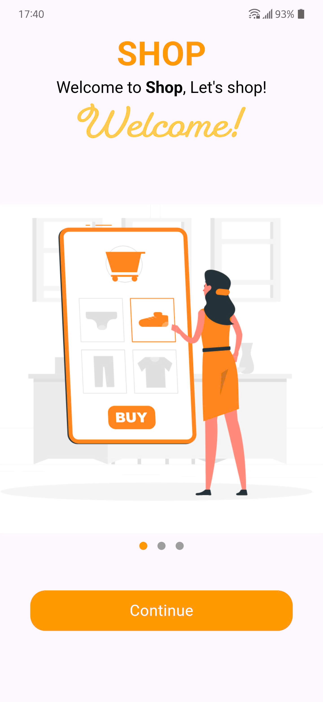
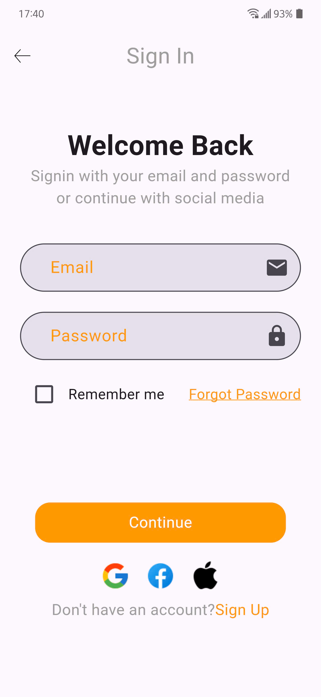
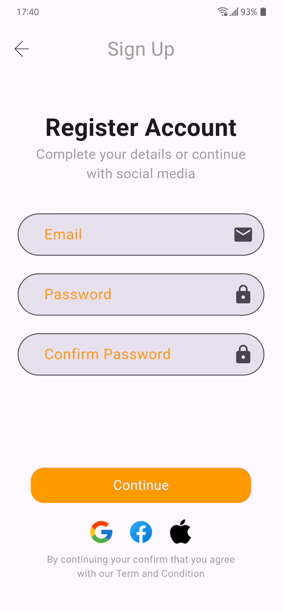
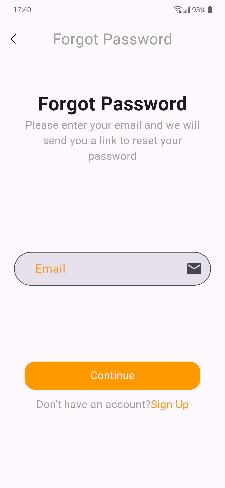
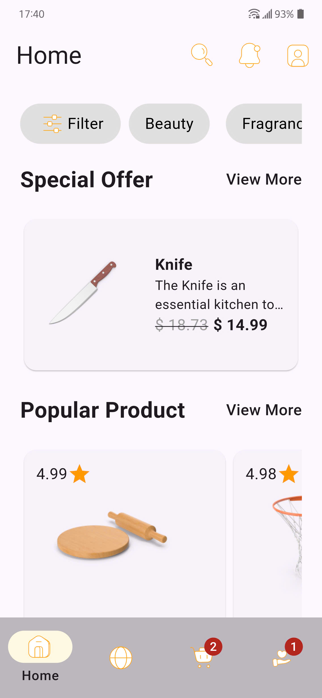
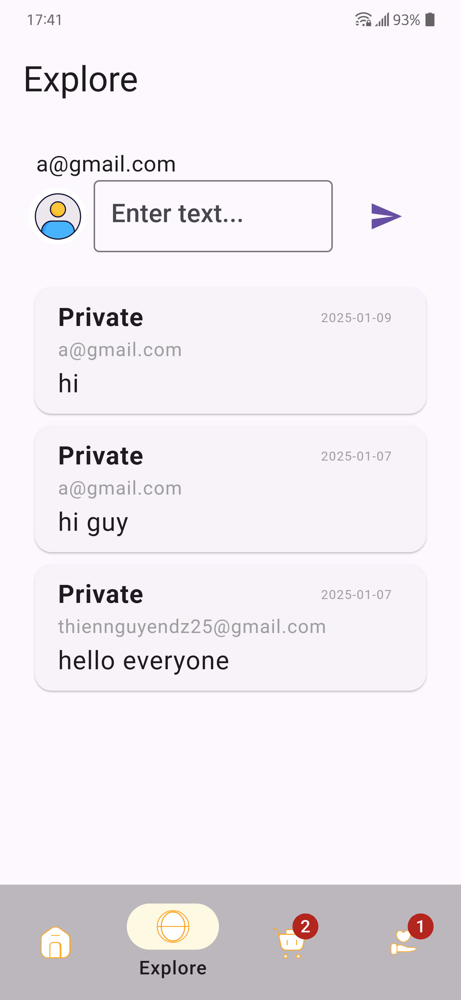
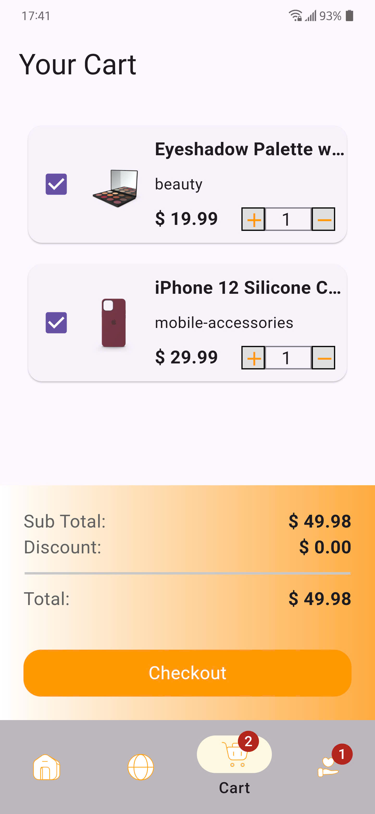
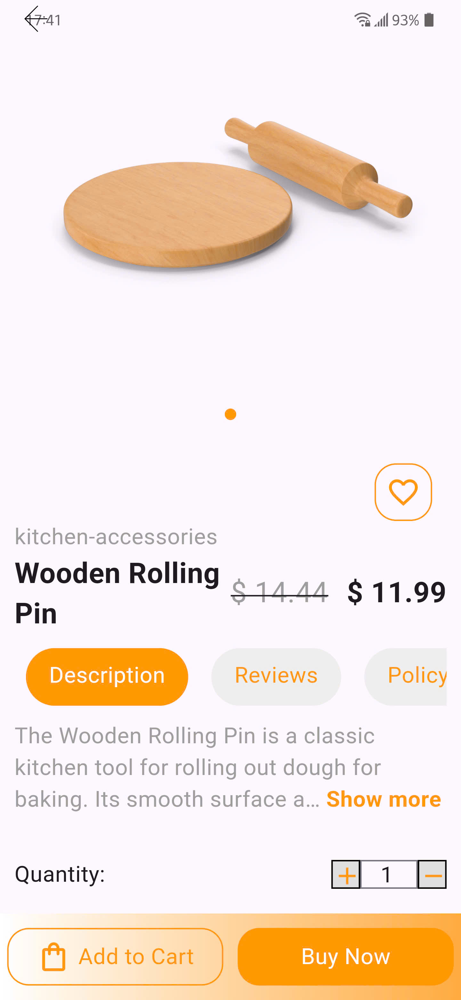
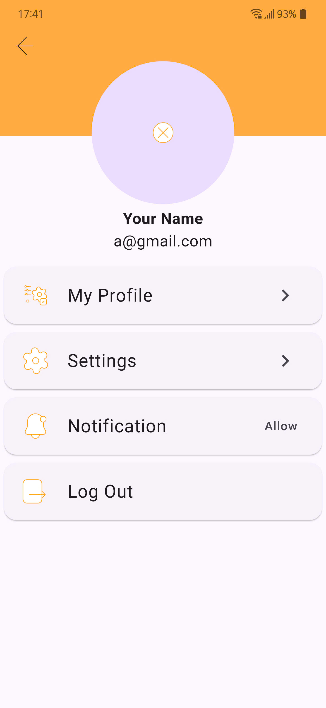
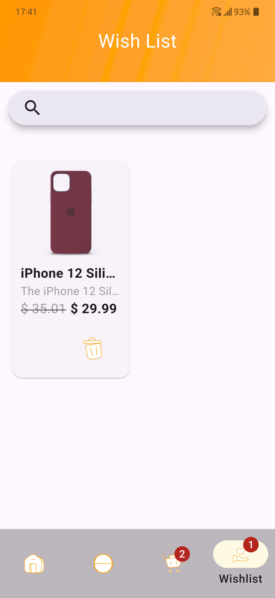

# UniStore 
**"UniStore - Where all your shopping needs come together!"**  
Discover thousands of products, from fashion, beauty, and technology to home decor and accessories. UniStore brings convenience, variety, and a modern shopping experience, all at your fingertips.

## Key Features 

### 1. **Product Management**  
- Browse and search through product categories such as:  
  - Men's and women's fashion (shirts, dresses, shoes, bags, watches, jewelry).  
  - Beauty and skincare.  
  - Furniture and home decor.  
  - Household items and kitchen accessories.  
  - Technology devices: laptops, smartphones, tablets.  
  - Accessories: sunglasses, sports accessories, mobile accessories.  

### 2. **Smart Search**  
- Search products by keywords, categories, or filter by criteria such as price, brand, or reviews.  

### 3. **Cart and Checkout**  
- Add products to the shopping cart.  
- Adjust quantities and view total costs before checkout.  

### 4. **User Account Management**  
- Sign up, log in and fortgot account via email.

### 5. **Personalized Notifications** 
- Send notifications about orders or favorite products. 

### 6. **Chat with the community**
- Chat directly with the people

## Technology Stack  

### 1. **Frontend**  
- **Flutter**: A cross-platform framework for developing smooth and intuitive user interfaces.  

### 2. **Backend**  
- **Firebase**:  
  - **Authentication**: Manage user registration, login, and authentication.  
  - **Firestore Database and Realtime Database**: Real-time NoSQL database for data storage.  

### 3. **API Integration**  
- **RESTful API**: Connect with external services or custom backend features.  
- **Http (Flutter)**: Libraries for making HTTP requests.  

### 4. **State Management**  
- **Riverpod**: Efficiently manage application state.

### 5. **Other Tools and Libraries**  
- **Payment Gateway**: Integration with payment gateways (Stripe).  

## Project results

### Image:
         

### Video:
- [Link Youtube demo](https://youtube.com/shorts/ZJx1Qil9T7k?feature=share)
- [Link Cloudinary demo](https://res.cloudinary.com/dksr7si4o/video/upload/v1752901750/flutter/video_kq/App_UniStore_demo_jrnsef.mp4)

